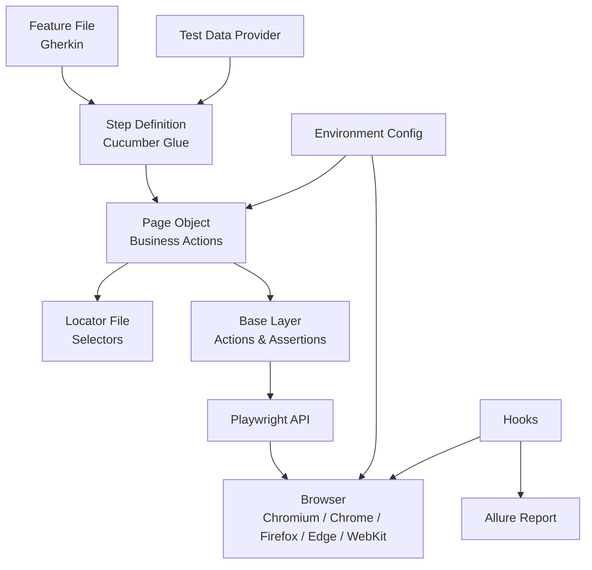
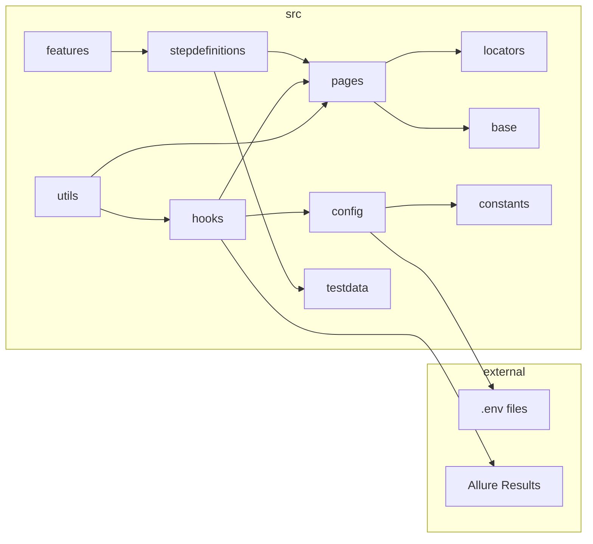
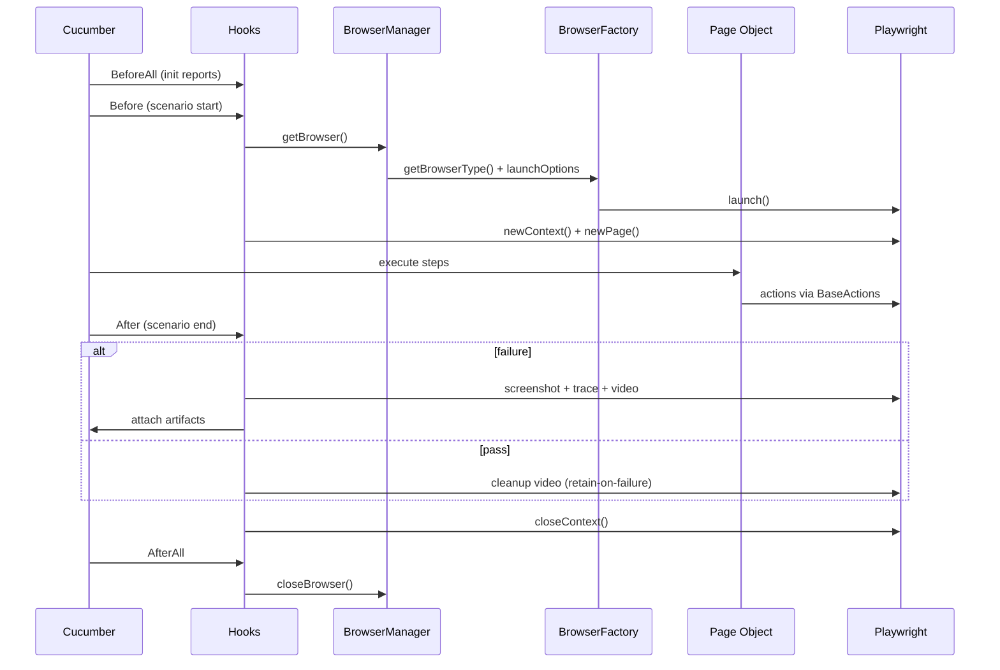
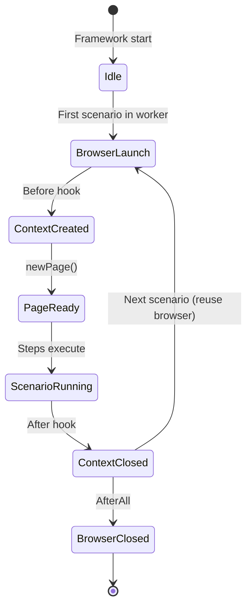
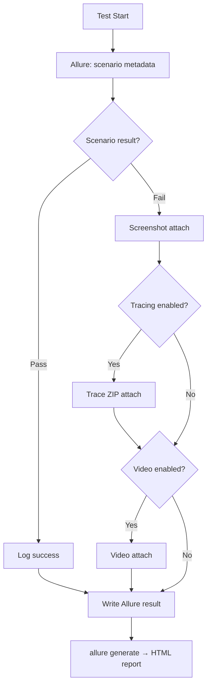

# Architecture

Visual reference for framework design, lifecycles, and folder relationships.

## Framework Flow

## Layer Responsibilities

| Layer           | Input                 | Output              | Contains       |
| --------------- | --------------------- | ------------------- | -------------- |
| Feature         | Business requirements | Gherkin scenarios   | Tags, Examples |
| Step Definition | Gherkin step          | Page method call    | No Playwright  |
| Page            | Business intent       | Composed actions    | No selectors   |
| Locator         | UI structure          | Playwright Locators | No logic       |
| Base            | Locators + intent     | Playwright calls    | Generic only   |

## Folder Relationships

## Execution Lifecycle

## Browser Lifecycle

One **browser** per Cucumber worker. One **context + page** per scenario.

## Reporting Lifecycle

## Browser Selection

Configured via `BROWSER` environment variable — no code changes:

| Value      | Engine                        |
| ---------- | ----------------------------- |
| `chromium` | Playwright Chromium (default) |
| `chrome`   | Installed Google Chrome       |
| `firefox`  | Playwright Firefox            |
| `edge`     | Installed Microsoft Edge      |
| `webkit`   | Playwright WebKit             |

## Related Documentation

- [Folder Structure](folder-structure.md)
- [Configuration](configuration.md)
- [Running Tests](running-tests.md)
- [`.cursor/rules/architecture.md`](../.cursor/rules/architecture.md)
